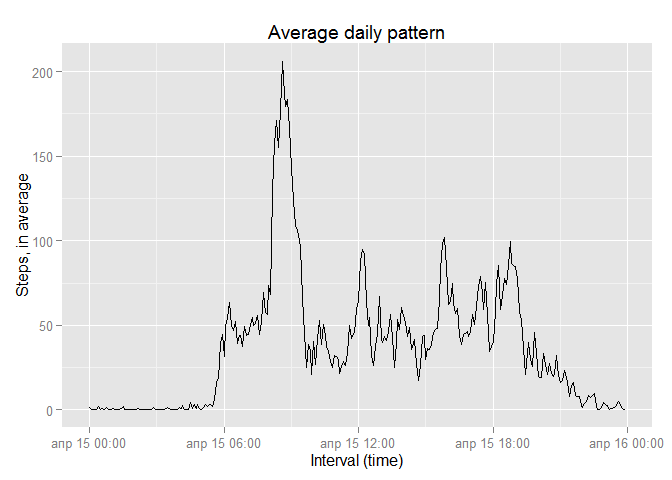
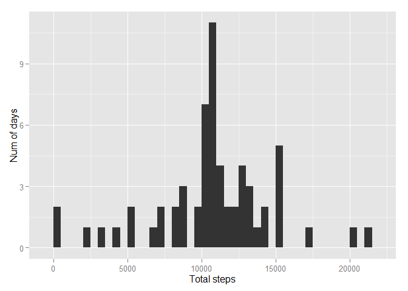
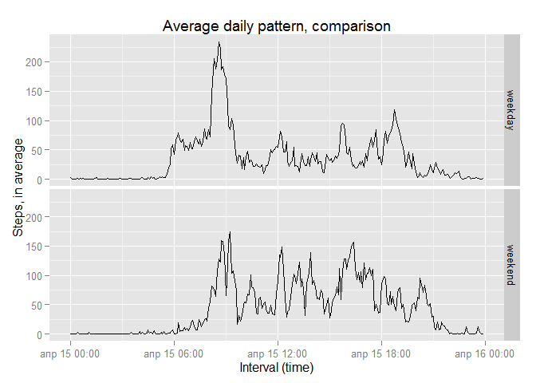

# Reproducible Research: Peer Assessment 1

## Loading and preprocessing the data


```r
xdata<-read.csv("activity.csv")
```

## What is mean total number of steps taken per day?


```r
library(dplyr)
```

```
## 
## Attaching package: 'dplyr'
## 
## The following object is masked from 'package:stats':
## 
##     filter
## 
## The following objects are masked from 'package:base':
## 
##     intersect, setdiff, setequal, union
```

```r
xdataGrDay<- xdata %>%
  select(c(steps,date)) %>%
  filter(!is.na(steps))%>%
  group_by(date) %>%
  summarize(total = sum(steps))

meanSource<-mean(xdataGrDay$total)
medianSource<-median(xdataGrDay$total)
```

Mean of steps is 1.0766189\times 10^{4} and median is 10765.

## What is the average daily activity pattern?


```r
library(ggplot2)
xdataGrInt<- xdata %>%
  select(c(steps,interval)) %>%
  filter(!is.na(steps))%>%
  group_by(interval) %>%
  summarize(m = mean(steps))

xdataGrInt$intervalTime <- as.POSIXct(strptime(sprintf("%04d",xdataGrInt$interval), "%H%M"))

ggplot(data = xdataGrInt, aes(x=intervalTime, y=m)) + geom_line(stat="identity")+xlab("Interval (time)")+ylab("Steps, in average")+ggtitle("Average daily pattern")
```

 

The most active time interval:


```r
strftime(xdataGrInt$intervalTime[xdataGrInt$m == max(xdataGrInt$m)],"%H:%M")
```

```
## [1] "08:35"
```

## Imputing missing values

Total NAs:


```r
sum(is.na(xdata$steps))
```

```
## [1] 2304
```

For imputing we will use mean values in this interval through all days (as it was calculated on the previous step).


```r
xdataFilled<-merge(x = xdata,y = xdataGrInt,by.x = "interval",by.y = "interval")
xdataFilled<-mutate(xdataFilled,stepsFilled=steps)
xdataFilled$stepsFilled[is.na(xdataFilled$steps)]<-xdataFilled$m[is.na(xdataFilled$steps)]

xdataGrFilled<- xdataFilled %>%
  select(c(stepsFilled,date)) %>%
  group_by(date) %>%
  summarize(total = sum(stepsFilled))

meanFilled<-mean(xdataGrFilled$total)
medianFilled<-median(xdataGrFilled$total)
dMean <- (meanFilled - meanSource) / meanSource * 100
dMedian <- (medianFilled - medianSource) / medianSource * 100
```

After imputing mean of steps is 1.0766189\times 10^{4} and median is 1.0766189\times 10^{4}.  
Values changed on 0% and 0.0110421% respectively.  
New histogram of total steps per day:


```r
ggplot(xdataGrFilled, aes(x = total))+geom_histogram(binwidth = 500)+xlab("Total steps")+ylab("Num of days")
```

 

## Are there differences in activity patterns between weekdays and weekends?


```r
xdata$wday <- as.POSIXlt(x = as.character(levels(xdata$date)[xdata$date]), format = "%Y-%m-%d")$wday
wdayDf<-data.frame(day=0:6,wdayFact=as.factor(x = c("weekend","weekday","weekday","weekday","weekday","weekday","weekend")))
xdataWd<-merge(x = xdata, y = wdayDf, by.x = "wday",by.y = "day")

xdataGrWday<- xdataWd %>%
  select(c(steps,wdayFact,interval)) %>%
  filter(!is.na(steps))%>%
  group_by(interval,wdayFact) %>%
  summarize(m = mean(steps))

xdataGrWday$intervalTime <- strptime(sprintf("%04d",xdataGrWday$interval), "%H%M")
xdataGrWday$intervalTime <- as.POSIXct(xdataGrWday$intervalTime)
ggplot(data = xdataGrWday, aes(x=intervalTime, y=m)) + geom_line(stat="identity")+xlab("Interval (time)")+ylab("Steps, in average")+ggtitle("Average daily pattern, comparison")+facet_grid(wdayFact~.)
```

 

